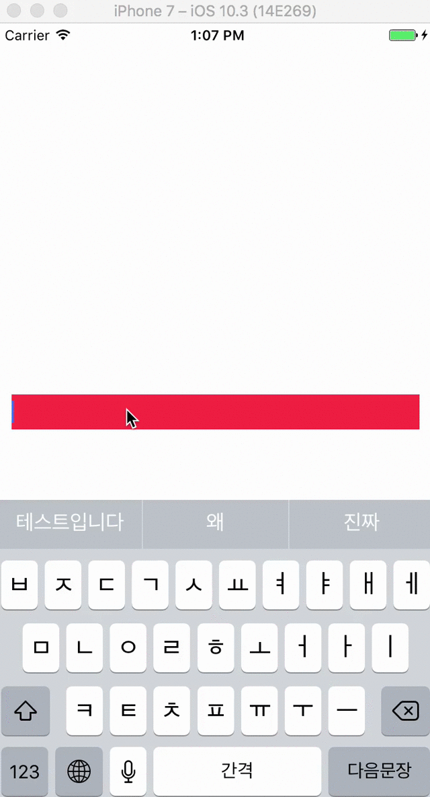
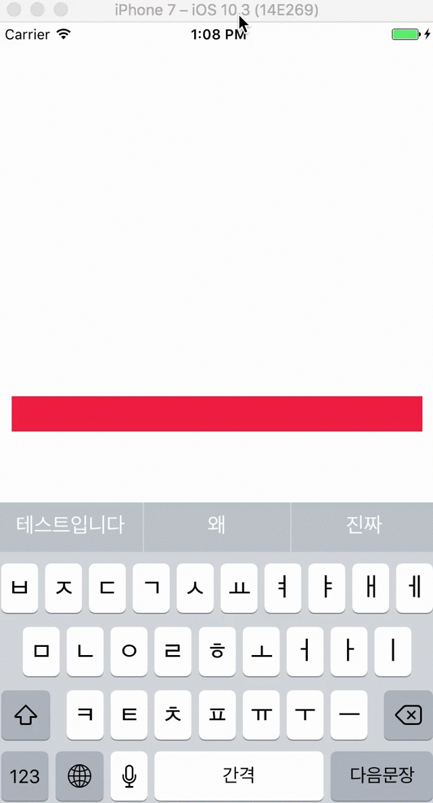

# UITextField+TextOffsetFix

- UITextField character moves down when editing bug fix in iOS10

#### Bug in iOS10


#### Fix


## Example
To run the example project, clone the repo, and run `pod install` from the Example directory first.

## Installation

#### CocoaPods
Sniffer is available through [CocoaPods](http://cocoapods.org). To install
it, simply add the following line to your Podfile:

```ruby
pod "UITextField+TextOffsetFix"
```

## Usage

#### Objective-C
```objc
@import UITextField_TextOffsetFix;
```

#### Swift
```swift
import UITextField_TextOffsetFix
```

## Questions

#### Why did you write the library in Objective-C, not Swift?
```
Method 'initialize()' defines Objective-C class method 'initialize', which is not guaranteed to be invoked by Swift and will be disallowed in future versions
```

## Authors

Taeun Kim (kofktu), <kofktu@gmail.com>

## License

UITextField+TextOffsetFix is available under the ```MIT``` license. See the ```LICENSE``` file for more info.
